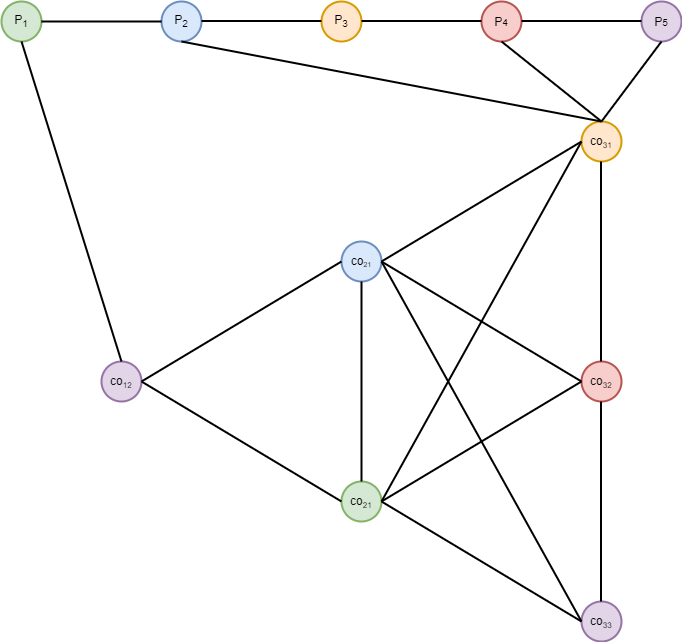
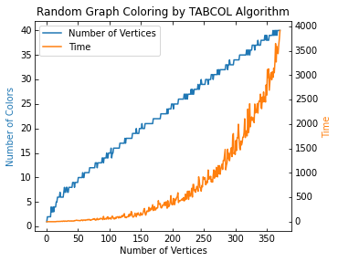
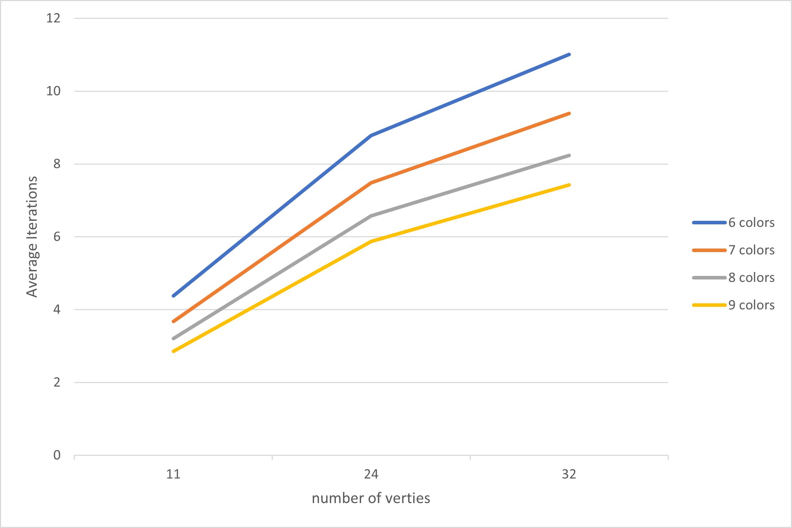

# Using Tabu Search Algorithm to Solve University Timetable Problem

This repository contains the code and report for my bachelor thesis `Using Tabu Search Algorithm to Solve University
Timetable Problem`. This project focus on giving a general description and some examples to solve timetable problem in educational institutions. Since timetable problem can be turned into graph coloring problem, we introduce tabu search algorithm and adapted it to our model.

## Graph Coloring Representation

  
  
<em> Representation with some soft constraints (pre-assignment).</em>

## Graph Coloring

  
  
<em> Time and color needs to color a graph with different number of vertices.</em>

## Example

  
  
<em> Average iterations of n colors, per 10000 attempts.</em>

